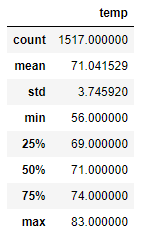

# Surfs Up Analysis

## Overview of the Surfs Up Analysis

### Purpose

##### The purpose of Module Nine and the Surfs Up Analysis is to use SQLite, SQLAlchemy, and Flask using Python, Jupyter Notebook, its dependencies, and VSCode to analyze weather data for the Hawaiian island of O'ahu to determine the potential success of an ice cream surf shop on the island.

### Results

##### The results of the Surfs Up Analysis determined the following:
- Based on count of 1,700 temperatures in the month of June over the course of seven years, the average temperature is calculated at 75 degrees, minimum of 64 degrees, and maximum of 85 degrees.
- Based on count of 1,517 temperatures in the month of December over the course of seven years, the average temperature is calculated at 71 degrees, minimum of 56 degrees, and maximum of 83 degrees.
- There are 183 more temperatures analyzed for June statistics than December statistics for the seven year period, however the amount of variance between the two data sets is relatively close to one another at 3.26 standard deviation (June) and 3.75 standard deviation (December).

### June Statistics

### December Statistics

### Summary

##### In summary, it would be my opinion that the island of O'ahu is an ideal location for an ice cream surf shop that would have business year-round.  After running two additional queries by creating histograms of the June and December temperature data, it appears that the month of December actually has temperatures greater than 70 and 75 degrees over 300 times each also verifying that O'ahu would be an ideal location for the ice cream surf shop year-round.

### June Histogram

### December Histogram
